# DP.ARCH.004 — Архитектура данных Neon

**Целевое состояние:** 12 баз данных Neon + 1 legacy-система (LMS Aisystant). Каждая БД = один BoundedContext с единым семантическим writer-owner. Термин «ЦД» (монолитный цифровой двойник) упразднён — на его место пришла трёхслойная модель Персона / Память / Контекст (WP-257). 9 БД предыдущей версии декомпозированы с учётом 12 правок Андрея (Ф24, Д1-Д12) и правил границ SPF.SPEC.005.

**Стратегия реализации:** документ описывает целевое состояние **новой архитектуры платформы** (BC-aligned, database-per-BC, микросервисная, EDA). Реализация поэтапная: **IWE — пилот новой архитектуры** (строится сразу на 12 БД); **ШСМ работает на старой архитектуре** (монолит LMS Aisystant) и **постепенно мигрирует на новую** после стабилизации IWE. В процессе миграции лучшие архитектурные паттерны LMS (наставничество, прохождения, ДЗ-ответы, формальная квалификация) переносятся в новую арх — см. §3.6 «Источник паттернов» и §3.13. В короткий срок LMS остаётся legacy-источником истории ШСМ с read-only bridges в `#6 / #12 / #3 / #2`.

**Полный физический инвентарь Neon prod (29 апр 2026, после WP-268 DROP platform):** 12 entity-БД + 3 special-БД = **15 БД** (плюс `postgres` system + 2 templates = 18 строк в `\l`, не считаются).

| Категория | БД | Принцип |
|---|---|---|
| **12 entity (BC-aligned, §3)** | persona, journal, payment, subscription, indicators, learning, knowledge, reference, publication, community, lead, rewards | database-per-BoundedContext |
| **3 special (operational support)** | health (observability — internal_metrics, error_logs, ANTHROPIC_STATUS), metabase (admin-tool metadata, paused), payment_registry (autopay tokens, отдельная БД по B7.3 — payment_credentials строже PII) | Не доменные сущности; параллельно entity-уровню (§10.10 admin/state-tools placement) |

**Дополнительные state-БД вне Neon (Railway PG cluster `peaceful-vision/Postgres`):**

| БД | Назначение | Размещение по DP.D.049 / §10.10 |
|---|---|---|
| `bot_data` | lift-and-shift legacy platform монолит (57 таблиц, до 12-BC миграции G1-G9 — §10.11) | временный технический долг |
| `fsm` | aiogram fsm_states (state file бота) | §10.10 — рядом с исполнителем |
| `directus` | admin/CMS metadata (29 таблиц framework state) | §10.10 — рядом с исполнителем |
| `railway` | пилотный bot data (служебная Railway) | dev-окружение |

**Документ построен так:** сначала — сводная таблица 12 БД (§1), затем карта (§2), потом ERD по каждой БД (§3), связи между БД (§4), потоки (§5), писатели-читатели (§6), что осталось вне Neon (§7), миграция (§8), верификация по трём чеклистам (§9), открытые вопросы (§10).

---

<details open>
<summary><b>1. Сводная таблица 12 БД (целевая карта)</b></summary>

**Источник:** WP-228 Ф25 (22 апр 2026). Каждая строка проходит Step 0 SPF.SPEC.005 (категория WP-257) + B1-B4 (выделение БД) + N1-N5 (именование). Верификация — §9.

| # | БД (RU / `en`) | Категория WP-257 | Кто пишет (writer-owner) | Физ.объекты домена | Таблицы (RU / `en`) |
|---|---|---|---|---|---|
| 1 | **Персона** / `persona` | Персона | пользователь через любой интерфейс (VS Code, бот, веб, CLI) + personal-indexer (эмбеддинги личных Git-репо) | учётка — ссылка на Ory (О), запись декларации о себе (роли/ценности/цели) (О), запись предпочтений (О), захват (О), заметка (О), коллекция личная (О), документ (О), параграф (О), эмбеддинг (О), запись-редакция (О) | Учётка / `account`, Предпочтения / `preferences`, Захваты / `captures`, Заметки / `notes`, Коллекция / `collection`, Документ / `document`, Параграф / `paragraph`, Эмбеддинг / `embedding` |
| 2 | **Журнал** / `journal` | Память.Observed | event-коллектор (единая точка записи от бота, веба, VS Code, CLI) | запись события с `action_type` (открытие / чтение / ответ / клик / отправка / перенос / отмена / …) (О), сессия (О) | Событие / `event`, Сессия / `session`, Контекст-действия / `action_context` |
| 3 | **Платёж** / `payment` | Память.Observed | billing-webhook (ЮKassa, Telegram Stars), админ через Directus, payout-engine (расщепление дохода и выплаты получателям) | плательщик — юрлицо/физлицо (О), платёж (О), возврат (О), сохранённое средство оплаты — токен + маска, вид в `#8 payment_kind` (О), чек (О), партнёрство по доходу — автор руководства / наставник потока / маркетинг / МИМ / иной получатель выплат (О), расщепление платежа — факт распределения одного входящего платежа на доли получателей (О), выплата — исходящая операция получателю (О) | Плательщик / `payer`, Платёж / `payment`, Возврат / `refund`, Сохранённое-средство-оплаты / `saved_payment_tool`, Чек / `receipt`, Партнёрство-по-доходу / `revenue_share_contract`, Расщепление-платежа / `payment_split`, Выплата / `payout` |
| 4 | **Подписка** / `subscription` | Память.Observed | subscription-service (создание контрактов, продление, отмена, пауза); WP-270 multi-domain-projection-worker (UPSERT по `subscription_granted` event) | контракт подписки (О, исторический термин — «грант»), автосписание — правило повторного платежа по контракту (О); тарифный план см. `#8 reference.tariff` (К); срез истории изменений контракта `contract_event` — журнальная таблица audit-trail, не самостоятельный физ.объект | Контракт / `contract`, Автосписание / `autopay`, Событие-контракта / `contract_event` |
| 5 | **Показатели** / `indicators` | Память.Derived | Портной-engine (расчёт baseline, потенциала, индикаторов, RCS-ступени, проекций) | замер — факт измерения в момент `t`, возможен шум (О); снапшот Pack-состояния — кэш on-demand с TTL (О); baseline-значение — устойчивый уровень, сглаженный по окну замеров (С); потенциал — верхняя граница шкалы на момент `t` (С); индикатор — derived-композит из базовых показателей (С); RCS-ступень текущая 1-5 — проекция последней классификации (С) | Замер / `measurement`, Baseline / `baseline`, Потенциал / `potential`, Индикатор / `indicator`, RCS-ступень / `rcs_current`, Снапшот / `snapshot` |
| 6 | **Обучение** / `learning` | Память.Observed + Derived | learning-service, наставники через Directus, scheduler лент/дайджестов | зачисление в IWE-программу (ЛР/РР/МР) с активным руководством из вертикального каталога `#8 reference.guide` (О), рабочая тетрадь (О), ДЗ (О), ответ ученика (О), оценка (О), проверка наставника (О), попытка практики (О), пара вопрос-ответ Q&A (О), марафон (О), обратная связь (О), лента-неделя (О), лента-сессия (О); прогресс по руководству — derived-агрегат из ответов и оценок (С); персональное руководство — опциональная надстройка (Git пользователя, проекция через `#1 persona`) | Зачисление / `enrollment`, Прогресс / `course_progress`, Рабочая-тетрадь / `workbook`, ДЗ / `assignment`, Ответ / `answer`, Оценка / `assessment`, Проверка-наставника / `mentor_review`, Попытка / `practice_attempt`, Вопрос-ответ / `qa_pair`, Марафон / `marathon`, Обратная-связь / `feedback`, Лента-неделя / `feed_week`, Лента-сессия / `feed_session` |
| 7 | **Знание-платформы** / `knowledge` | Platform-knowledge (проекция) | knowledge-mcp индексатор (эмбеддинги PACK-digital-platform, PACK-MIM, PACK-ecosystem, ZP, FPF, SOTA, Glossary, руководств) | `#7` = проекция Git-репозиториев, самостоятельных физ.объектов нет. Все записи — snapshot исходных файлов с versioning: коллекция — namespace по источнику `platform.digital-platform` / `platform.MIM` / `platform.sota` / `platform.guides.{program_id}.{guide_id}` (С); документ / параграф — snapshot Git-файла (С); эмбеддинг — derived вектор (С); версия индекса (С); понятие и связь — извлечённая онтология, derived (С) | Коллекция / `collection`, Понятие / `concept`, Связь / `relation`, Документ / `document`, Параграф / `paragraph`, Эмбеддинг / `embedding`, Версия-индекса / `index_version` |
| 8 | **Справочник** / `reference` | Catalog/Reference | админ через Directus (редкие правки, источник истины = реестры и решения Методсовета) | тариф (О); программа ЛР/РР/МР (О); руководство — запись вертикального каталога руководств с уровнем, зависимостями, автором; контент — в `#7 knowledge` namespace `platform.guides.*` (О); правило начисления баллов (О); правило распределения дохода — шаблон split по (Программа, Руководство): автор X %, наставник Y %, маркетинг Z %, МИМ W %, override через `#3 revenue_share_contract` (О); лимит эмиссии баллов — месячный потолок выпуска (опционально, для контроля инфляции) (О); ступень ученика 1-5 RCS (К); уровень квалификации — 11-ступенчатая шкала (К); вид способа оплаты — карта / СБП / Telegram Stars (К); множитель (К); константа (К) | Тариф / `tariff`, Программа / `program`, Руководство / `guide`, Правило-начисления / `reward_rule`, Правило-распределения-дохода / `revenue_share_rule`, Лимит-эмиссии / `emission_limit`, Ступень-ученика / `rcs_stage`, Уровень-квалификации / `qualification_level`, Вид-способа-оплаты / `payment_kind`, Множитель / `multiplier`, Константа / `constant` |
| 9 | **Публикации** / `publication` | Память.Observed | content-pipeline (создание → публикация → каналы) | черновик (О), статья (О), пост (О), канал публикации (О), событие публикации — факт ухода поста в канал в момент `t` (О), UTM-метка как сохранённая запись (О); аналитика охвата — derived-агрегат событий публикации и чтений (С) | Черновик / `draft`, Статья / `article`, Пост / `post`, Канал / `channel`, Событие-публикации / `publication_event`, UTM / `utm_tag`, Аналитика / `reach_analytics` |
| 10 | **Сообщество** / `community` | Relational | matching-engine (Random Coffee), mentorship-service, referral-tracker, ambassadorship-service, event-organizer, initiative-coordinator | наставничество — назначение роли наставника конкретной Персоне с периодом (О); амбассадорство — назначение роли амбассадора Персоне на период (О); «амбассадор» = роль, сама запись «амбассадорство» = объект; пара Random Coffee (О); встреча 1:1 (О); отзыв о встрече (О); реферальная связь (О); группа — сообщество/когорта (О); запрос помощи (О); отклик на помощь (О); событие сообщества — митап, воркшоп (О); инициатива развития (О); вклад члена (О) | Наставничество / `mentorship`, Амбассадорство / `ambassadorship`, Пара / `match`, Встреча / `meeting`, Отзыв / `meeting_feedback`, Реферал / `referral`, Группа / `group`, Вопрос-помощь / `help_request`, Отклик / `help_response`, Событие-сообщества / `community_event`, Инициатива / `initiative`, Вклад / `contribution` |
| 11 | **Лид** / `lead` | Proto-Persona | landing (форма регистрации), acquisition-funnel (UTM-трекер, веб-аналитика) | лид — Proto-Persona до получения Ory identity (О); UTM-заход — сохранённая запись посещения с метками (О); запись воронки с `event_type` (visit / signup / activation / …) (О); конверсия — факт превращения лида в Персону (О) | Лид / `lead`, UTM-заход / `utm_visit`, Запись-воронки / `funnel_record`, Конверсия / `claim` |
| 12 | **Награды** / `rewards` | Память.Observed + Derived | rewards-engine (начисление по правилам из Справочника), Методсовет (присвоение квалификации) | движение баллов — единый журнал с `type` (grant / burn / transfer / expire), `amount`, `delta` (±), `reason`, `reference_id` — заменяет отдельный `points_grant` (О); ачивка (О); переход уровня квалификации — факт присвоения в момент `t` (О); награда — приз, артефакт (футболка, сертификат) (О); баланс баллов Персоны — derived-агрегат по `points_event` (С); текущий уровень квалификации — проекция последнего `qualification_change` (С); эмиссионный отчёт за месяц — derived-агрегат по `points_event` с типом `grant` (С) | Движение-баллов / `points_event`, Ачивка / `achievement`, Переход-квалификации / `qualification_change`, Текущая-квалификация / `qualification_current`, Награда / `reward`, Баланс / `points_balance`, Отчёт-эмиссии-за-месяц / `emission_monthly_report` |

### Категории WP-257 — покрытие

| Категория | Число БД | Какие |
|---|---|---|
| Персона | 1 | #1 |
| Память.Observed | 4 | #2, #3, #4, #9 |
| Память.Derived | 1 | #5 |
| Память.Observed+Derived (смешанные писатели) | 2 | #6, #12 |
| Platform-knowledge (проекция) | 1 | #7 |
| Catalog/Reference | 1 | #8 |
| Relational | 1 | #10 |
| Proto-Persona | 1 | #11 |
| Service/Ops | 0 | Вынесено на внешний SaaS (Д2) |

</details>

---

<details>
<summary><b>2. Карта 12 БД (обзор)</b></summary>

В каждом кластере — центральные физ.объекты БД по реестру §1. Межкластерные пунктирные стрелки с кратностями (1:1, 1:M, M:M) — связи между объектами разных БД по §4. Оранжевый кластер — внешняя LMS Aisystant (legacy, source-of-truth для исторических учебных данных, зеркалится в #6 и #12). Технические таблицы (`*_log`, `*_session`, `*_cache`, `*_state`, `*_snapshot`) не показаны на карте — они в §3 ERD по каждой БД.

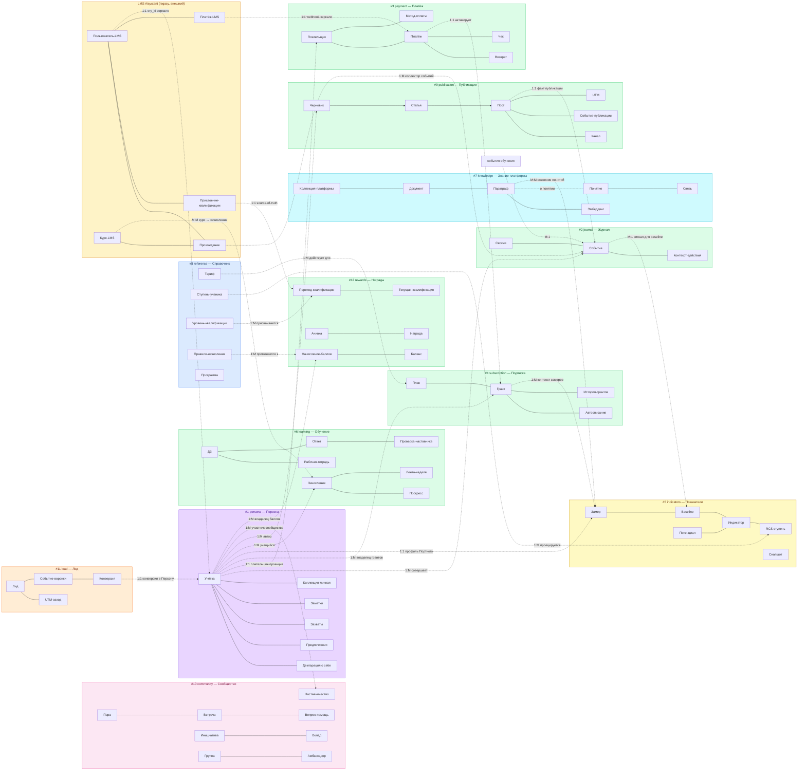

**Легенда цветов кластеров:**
- **Фиолетовый** — Персона (writer = пользователь, owner = Git + Neon projection)
- **Зелёный** — Память.Observed (writer = платформа, событийная)
- **Жёлтый** — Память.Derived (writer = расчётный engine)
- **Розовый** — Relational (связи между персонами)
- **Голубой-светлый** — Catalog/Reference (writer = админ)
- **Голубой-тёмный** — Platform-knowledge (проекция общей онтологии)
- **Оранжевый-светлый** — Proto-Persona (до Ory)
- **Оранжевый-тёмный** — Legacy external (LMS Aisystant)

**Легенда кратностей** (ER-стиль): **1:1** (один-к-одному), **1:M** (один-ко-многим), **M:1** (много-к-одному), **M:M** (много-ко-многим). Внутри кластера кратности опущены для читаемости — показаны в §3 ERD по каждой БД через нотацию `||--o{`.

</details>

---

<details>
<summary><b>3. ERD по каждой БД</b></summary>

> **Методологическое основание:** `DP.METHOD.040` §1 — концептуальная ER только объекты физ.мира. HD «ER ≠ Физ.схема», «Объект ≠ Отношение» (distinctions.md). Детальная физ.схема с колонками, типами и FK **[документ не создан, планируется в WP-253 Ф2 как `DP.ARCH.004-physical-schema.md`]**. Не показаны: `*_log`, `*_cache`, `*_state`, `*_snapshot`, `*_staging`, промежуточные M:N без атрибутов.

### 3.1 #1 persona — Персона

**Категория WP-257:** Персона. **Writer:** пользователь через любой интерфейс (VS Code, бот, веб, CLI) + personal-indexer (эмбеддинги PACK-personal и DS-my-strategy Git-репо). **Owner:** Git пользователя, Neon хранит проекцию.

**BC:** Personal Declaration & Personal Knowledge Projection.

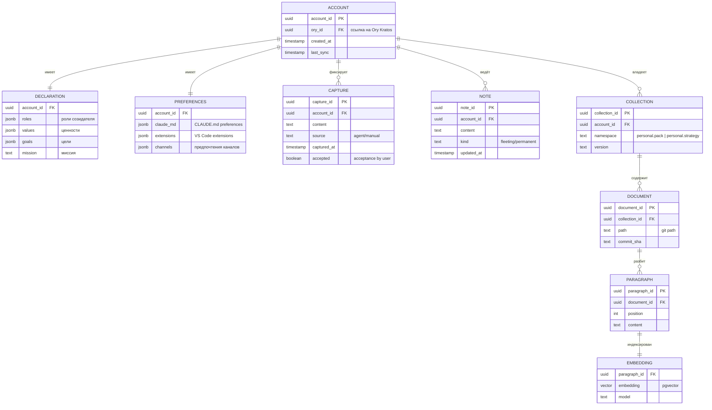

**Инвариант:** каждая запись в `account` соответствует одной записи в Ory Kratos (1:1 через `ory_id`). Удаление учётки в Neon ≠ удаление в Ory (Ory — внешняя система, см. Д1).

**Проекции:** таблицы `document`/`paragraph`/`embedding` — проекции Git-репо пользователя, rebuildable при `git pull` + reindex.

### 3.2 #2 journal — Журнал

**Категория WP-257:** Память.Observed. **Writer:** единый event-коллектор (бот, веб, VS Code, CLI шлют события через gateway). **Owner:** Neon.

**BC:** User Actions Event Stream.

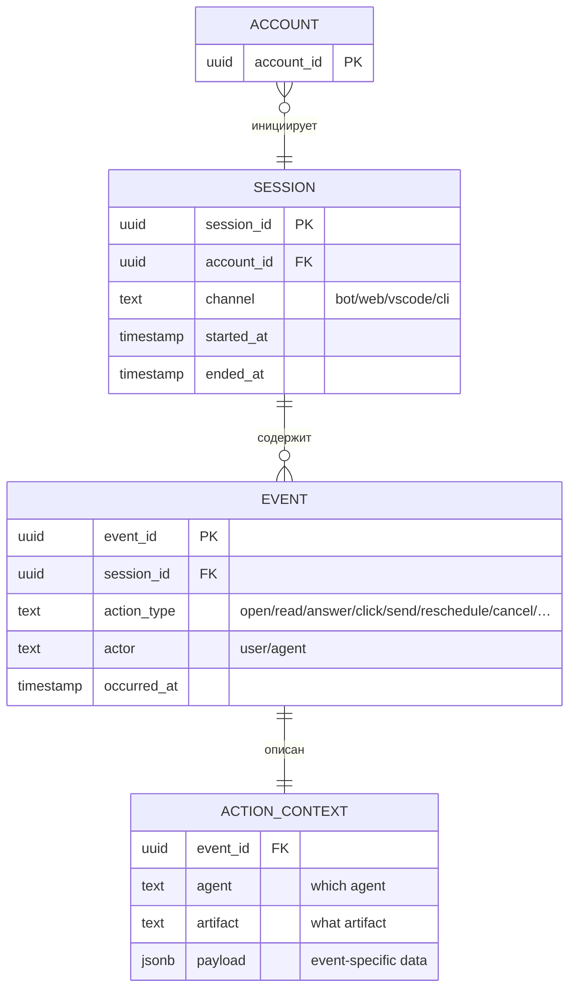

**Инвариант:** только-добавление — запись события не редактируется после создания (`action_context.payload` jsonb допускает обогащение метаданными, но не пересчёт факта). Хранение: 90 дней в горячем пути, архив в холодном хранилище по политике §7.

**Физ.объекты:** запись события с `action_type` (О); сессия (О). `action_context` — денормализация атрибутов события (агент, артефакт, payload), не самостоятельный физ.объект.

**Связи кросс-БД:** события из `#6 learning`, `#9 publication`, `#11 lead` могут проецироваться как `EVENT` в `#2 journal` через outbox-pattern (для единой ленты действий пользователя).

**Migrated 2026-04-29 (WP-268 Phase 3 Block 2):** legacy таблицы `qa_history` (1064 rows, PII Q&A текст) + `feedback_triage` (FK к qa_history, 0 rows на момент cut-over) перенесены из `platform.public` в `journal.public`. Бот (`aist_pilot_me`/`aist_me_bot`) пишет/читает через `JOURNAL_URL` env + `get_journal_pool()`. **Tech debt:** структура qa_history/feedback_triage остаётся «как было» (не нормализована в `EVENT`/`ACTION_CONTEXT` модель §3.2 ER). Нормализация — отдельный РП после стабилизации (≥W19), приоритет средний.

### 3.3 #3 payment — Платёж

**Категория WP-257:** Память.Observed. **Writers:** billing-webhook (ЮKassa, Telegram Stars), админ через Directus, payout-engine (расщепление входящих платежей на доли получателей + исходящие выплаты). **Owner:** Neon.

**BC:** Billing — приём платежей от пользователей, расщепление дохода и выплаты партнёрам (автор руководства, наставник потока, маркетинг, МИМ, иные получатели).

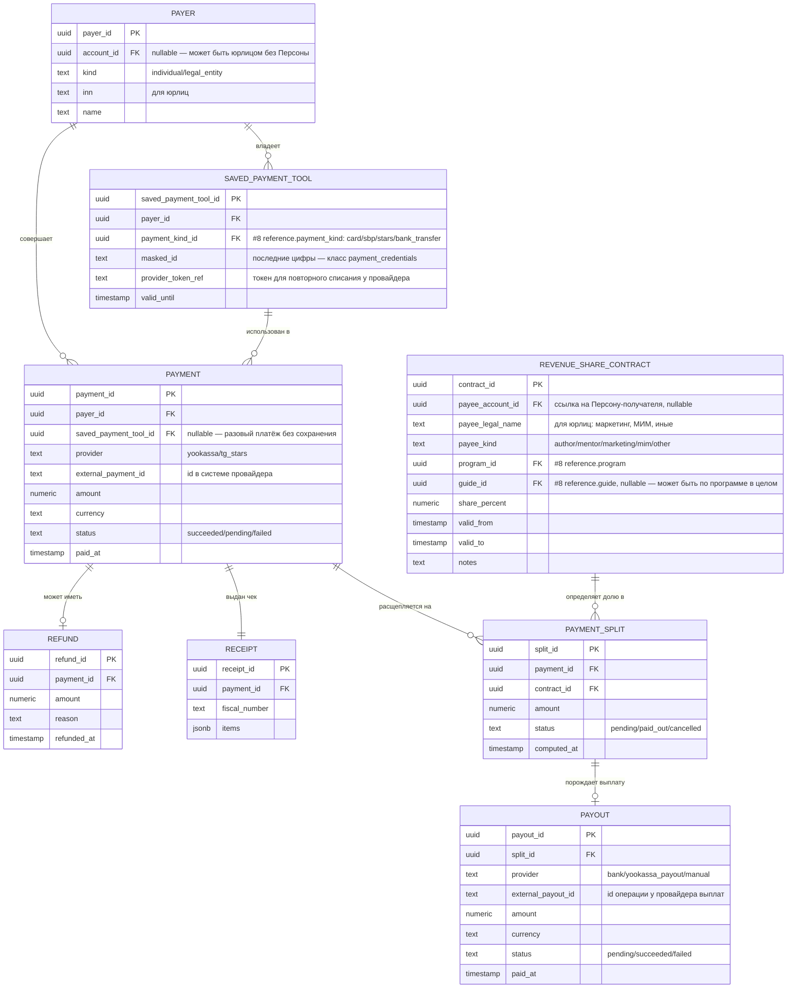

**Инвариант плательщика:** `PAYMENT.payer_id` — не `account_id` напрямую (плательщик ≠ Персона 1:1; юрлицо может оплачивать за сотрудника-ученика). Связь с Персоной — через `PAYER.account_id` (nullable).

**Инвариант расщепления:** для одного входящего `PAYMENT` сумма всех `PAYMENT_SPLIT.amount` ≤ `PAYMENT.amount` (остаток = бюджет МИМ по умолчанию или явно указанный получатель). Правила берутся из `#8 reference.revenue_share_rule` (шаблон по (program_id, guide_id)) + override через конкретный `REVENUE_SHARE_CONTRACT`.

**Инвариант выплаты:** `PAYOUT` создаётся только из `PAYMENT_SPLIT` со статусом `pending`. После успешной выплаты — `split.status = paid_out`, `payout.status = succeeded`. Одна `PAYOUT` закрывает ровно один `PAYMENT_SPLIT` (один-к-одному).

**Класс чувствительности:** `SAVED_PAYMENT_TOOL.masked_id` и `SAVED_PAYMENT_TOOL.provider_token_ref` = `payment_credentials` (строже PII — см. HD «PII ≠ payment_credentials»). Логирование строго запрещено, хранение только зашифрованным.

**Физ.объекты:** плательщик (О); платёж (О); возврат (О); сохранённое средство оплаты (О); чек (О); партнёрство по доходу (О); расщепление платежа (О); выплата (О). Вид способа оплаты (`payment_kind`) — классификатор (К) в `#8 reference`.

**Примечание (открытый вопрос):** контракты распределения дохода (`REVENUE_SHARE_CONTRACT`) пересекаются с ролевой моделью PACK-MIM (Портной / Оценщик / Наставник). Финальные имена колонок и границы с `#10 community.mentorship` (где фиксируется назначение наставника потоку) уточняются после WP-257 Ф5 (расщепление `DP.ARCH.003`). См. §10.8.

### 3.4 #4 subscription — Подписка

**Категория WP-257:** Память.Observed. **Writer:** subscription-service (создание контрактов, продление, отмена, пауза); WP-270 multi-domain-projection-worker (UPSERT по событию `subscription_granted` через cross-DB lookup). **Owner:** Neon.

**BC:** Subscription Rights & Lifecycle.

> **Терминологический apply (28 апр 2026):** в реальном DDL (`mvp/009-subscription-schema.sql`) таблицы называются `contract` и `contract_event` (не `grant`/`grant_history`, как в исходной v2.0 ER). Исторический термин «грант подписки» в текстах сохранён как синоним для читаемости, но canonical имена в коде — `contract` / `contract_event`. Drift между Pack ER (v2.0-2.4) и реальным DDL устраняется этим apply.

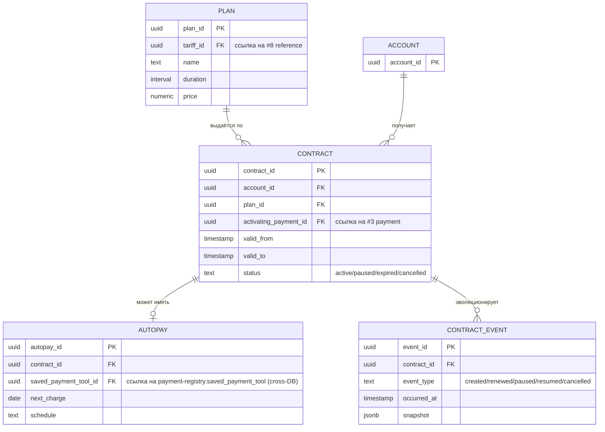

**Инвариант:** у одного `account_id` может быть несколько активных контрактов (семейный тариф, gift-подписки), но только один `primary` на каждый тип программы (ЛР/РР). Период `[valid_from, valid_to)` — полуоткрытый.

**Физ.объекты:** контракт подписки (О, исторический термин — «грант»); автосписание (О); тарифный план — подкласс тарифа из `#8 reference.tariff` с конкретным сроком и ценой (О). `contract_event` — audit-trail изменений контракта, журнальная таблица, самостоятельным физ.объектом не считается.

### 3.5 #5 indicators — Показатели

**Категория WP-257:** Память.Derived. **Writer:** Портной-engine (расчёт baseline, potential, индикаторов, RCS-ступени, проекций). **Owner:** Neon.

**BC:** Derived User Profile (было «ЦД» в v1).

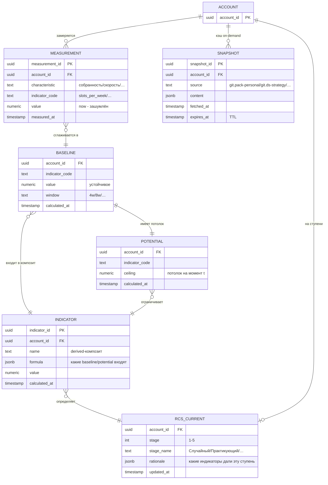

**Инвариант:** `BASELINE.value` — результат расчёта по окну `MEASUREMENT.value` (скользящее среднее/медиана); `POTENTIAL.ceiling` — не мгновенное, а целевой уровень с учётом фундаментального развития (годы). `RCS_CURRENT.stage` — derived-проекция из `INDICATOR` (не writable снаружи Портного).

**Решение WP-257 Ф2:** таблица называется `rcs_current` (не `stage`), чтобы не путалась с уровнем квалификации в `#12 rewards.qualification_current` (разные шкалы, разные писатели). См. HD «Характеристика ≠ Показатель ≠ Значение ≠ Потенциал».

**SNAPSHOT — кэш on-demand:** Портной не должен лазить в Git пользователя каждый расчёт. `SNAPSHOT` = кэш pull-данных из Git с TTL. При просрочке → invalidate → повторный запрос.

**Физ.объекты:** замер характеристики (О) — одно измерение `MEASUREMENT`; снапшот декларации (О) — один `SNAPSHOT` на момент времени. `BASELINE`, `POTENTIAL`, `INDICATOR`, `RCS_CURRENT` — derived-проекции (С), не самостоятельные физ.объекты, а результат расчёта Портного по `MEASUREMENT` и `SNAPSHOT`. См. HD «Характеристика ≠ Показатель ≠ Значение ≠ Потенциал».

### 3.6 #6 learning — Обучение

**Категория WP-257:** Память.Observed + Derived. **Writer:** learning-service, наставники через Directus, scheduler лент/дайджестов. **Owner:** Neon.

**BC:** Learning Progress & Mentorship Workflow (IWE-программы ЛР/РР/МР с вертикальным каталогом руководств; персональное руководство — опциональная надстройка из `#1 persona`).

**Архитектура контента:** Программа (каталог в `#8 reference`) содержит вертикальный каталог **руководств** — единая методология для всех учеников программы. Ученик зачислен в программу, проходит активное руководство по неделям. Персональное руководство (опция, WP-245) — Git-репо пользователя, дополняет или замещает каталожное руководство, проекция через `#1 persona.COLLECTION`. Традиционный каталог и персонализация сосуществуют.

**Источник паттернов:** `#6 learning` — реализация новой архитектуры (BC-aligned, events в `#2 journal`, derived-показатели в `#5`). Из монолита LMS Aisystant (старая архитектура ШСМ) **заимствуются проверенные паттерны**: COURSEPASSING → `ENROLLMENT`, SECTIONPASSING → прогресс по неделе, TASKANSWER → `ANSWER` + `MENTOR_REVIEW`, роль наставника, формальная квалификация. IWE — первая реализация новой архитектуры, наполняется с нуля IWE-программами (ЛР/РР/МР). После стабилизации IWE запускается миграция ШСМ с LMS на ту же архитектуру (см. §3.13, §10.7).

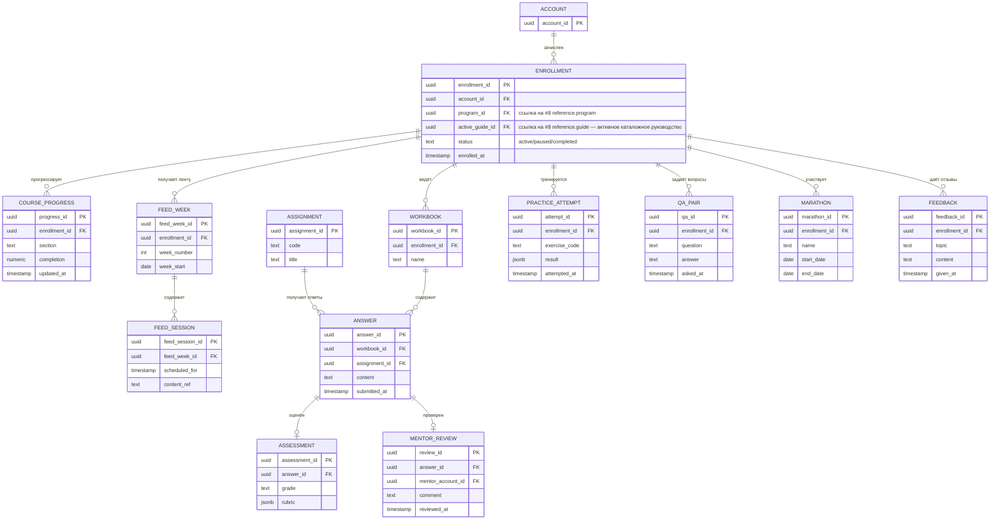

**Инвариант:** `MENTOR_REVIEW.mentor_account_id` ссылается на `ACCOUNT` с активным `MENTORSHIP` в `#10 community` (наставник — это роль, не атрибут учётки). `ENROLLMENT.active_guide_id` должен принадлежать каталогу `program_id` (consistency check через `#8 reference.guide.program_id`).

**Физ.объекты:** зачисление в программу (О); рабочая тетрадь (О); ответ на задание (О); проверка наставником (О); попытка тренажёра (О); диалог Q&A (О); марафон (О); отзыв ученика (О); лента недели (О) + сессия ленты (О). `COURSE_PROGRESS` — derived-проекция (С): вычисляется из ответов, проверок и попыток, не самостоятельный физ.объект. Оценка (`ASSESSMENT`) — запись решения экзаменатора (О).

**Legacy source:** таблицы `COURSE_PROGRESS`, `WORKBOOK`, `ANSWER` во время миграции читают из LMS Aisystant через bridge (`coursepassing`/`taskanswer`), до WP-254 Ф5.

### 3.7 #7 knowledge — Знание-платформы

**Категория WP-257:** Platform-knowledge (projection). **Writer:** knowledge-mcp индексатор (читает платформенные Pack Git-репо и эмбеддит). **Owner:** Neon (как проекция Git).

**BC:** Platform Ontology Projection.

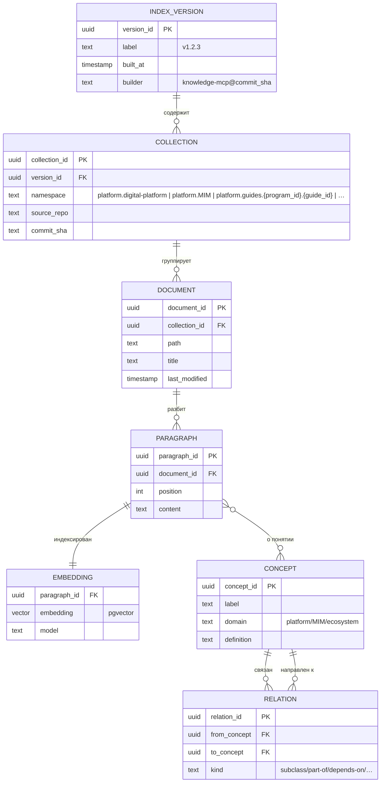

**Инвариант:** `COLLECTION.namespace` префиксом отделяет платформенные коллекции (`platform.*`) от личных (`personal.*` — живут в `#1 persona`). Переиндексация новой `INDEX_VERSION` не ломает активные запросы (старая версия доступна до переключения).

**Физ.объекты:** `#7` — проекция, не владелец фактов. Самостоятельных физ.объектов нет: `DOCUMENT`/`PARAGRAPH` — snapshot Git-файла (writer = индексатор), `EMBEDDING` — derived (С), `CONCEPT`/`RELATION` — извлечённая онтология. Физ.объект руководства (О) — метаданные в `#8 reference.guide`; тело руководства — Git-репо автора, а в `#7` проецируется в namespace `platform.guides.{program_id}.{guide_id}`.

**Concept graph:** 3503 рёбер / 1180 понятий / 344 переведено — актуальная статистика на 22 апр 2026 (WP-242).

### 3.8 #8 reference — Справочник

**Категория WP-257:** Catalog/Reference. **Writer:** админ через Directus (редкие правки, source-of-truth = реестры + решения Методсовета). **Owner:** Neon.

**BC:** Platform Reference Data.

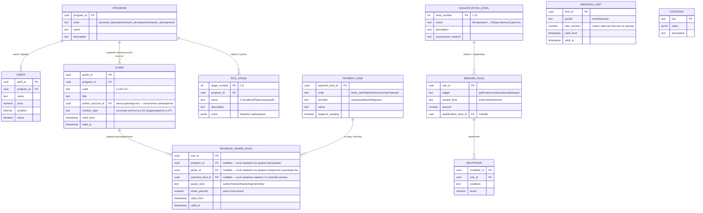

**Инвариант:** справочник обновляется редко и только админом. Все таблицы имеют `valid_from` / `valid_to` для историзации (temporal validity как перпендикулярный атрибут, WP-257).

**`REVENUE_SHARE_RULE` — правила scope resolution** (каскад от специфичного к общему):
1. Для входящего платежа определяется тройка `(program_id, guide_id, payment_kind_id)` из контракта.
2. Применяется самое специфичное активное правило (не-NULL по всем трём ключам).
3. Если нет — ищется правило с `payment_kind_id=NULL` (любой способ оплаты, специфичное руководство).
4. Если нет — правило с `guide_id=NULL` (любое руководство программы).
5. Если нет — правило с `program_id=NULL` (платформенный дефолт).
6. Сумма `share_percent` по выбранному уровню должна равняться 100 (проверка на уровне админки Directus, не CHECK-constraint, чтобы не блокировать временные состояния миграции). Правила разных уровней не смешиваются — выбирается один уровень целиком.

**Физ.объекты:** программа (О); тариф (О); руководство (О — единица ревшеринга и методологии); вид платежа (К — справочник способов оплаты); правило распределения дохода (О — договор ревшеринга платформы с получателем); лимит эмиссии (О — управленческое решение Методсовета по балльной эмиссии за период); ступень RCS (К); уровень квалификации (К); правило награды (О — решение Методсовета); множитель (К); константа (К). Справочные классификаторы (К) — читаются многими системами, writable только админом через Directus.

### 3.9 #9 publication — Публикации

**Категория WP-257:** Память.Observed. **Writer:** content-pipeline (создание → публикация → каналы). **Owner:** Neon.

**BC:** Content Publishing Pipeline.

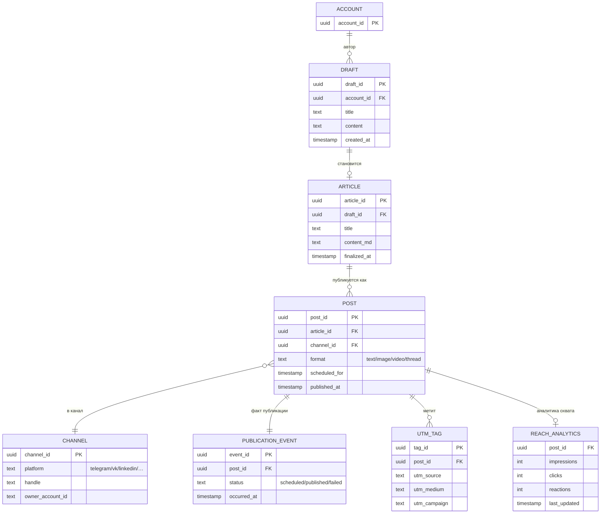

**Инвариант:** `ARTICLE.draft_id` — 1:1 с черновиком после финализации. `POST` может иметь несколько публикаций одного `ARTICLE` в разные каналы (мультиканальный publisher, WP-129).

**Физ.объекты:** черновик (О); статья (О — финализированный авторский артефакт); пост (О — экземпляр публикации в канале); канал публикации (О — TG-канал/VK-группа как внешняя площадка); факт публикации `PUBLICATION_EVENT` (О — запись успешной/неуспешной публикации); UTM-метка (О — маркер атрибуции). `REACH_ANALYTICS` — derived-проекция (С), агрегат внешней статистики каналов, не самостоятельный физ.объект.

### 3.10 #10 community — Сообщество

**Категория WP-257:** Relational (связи Persona↔Persona). **Writer:** matching-engine (Random Coffee), mentorship-service, referral-tracker, учёт амбассадорств, event-organizer, initiative-coordinator. **Owner:** Neon.

**BC:** Community Relations & Mutual Support.

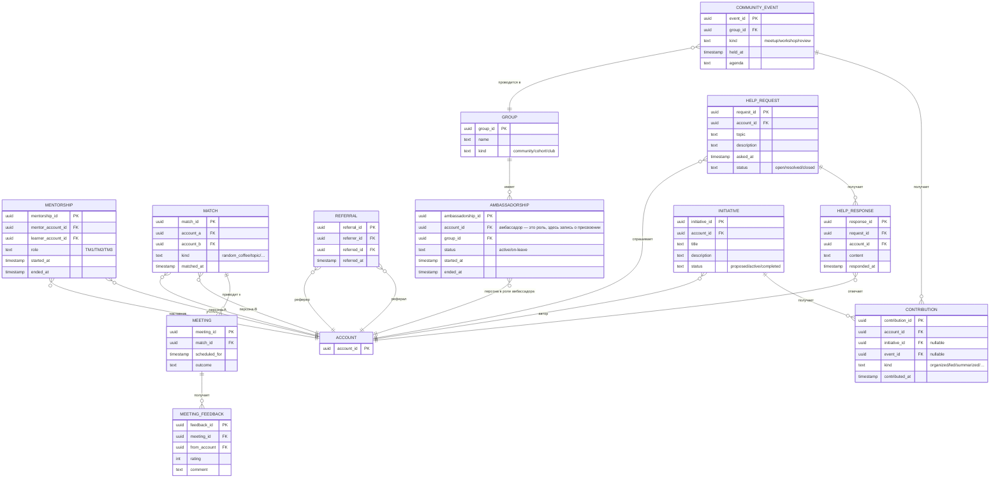

**Инвариант:** `MENTORSHIP.mentor_account_id` — это `ACCOUNT`, у которого есть активный `GRANT` на роль наставника (право проверять ДЗ), подтверждаемое через Keto policy. `MATCH` не превращается в `MEETING` автоматически — нужно действие пользователя (accept).

**Физ.объекты:** наставничество (О — присвоение роли наставника к связке наставник-ученик); мэтч (О — результат работы matching-engine); встреча (О); обратная связь по встрече (О); реферальство (О); амбассадорство (О — присвоение роли амбассадора в группе); группа/клуб/когорта (О); запрос помощи (О); ответ на запрос (О); событие сообщества (О); инициатива (О); вклад в инициативу/событие (О). В `#10` все сущности — это **отношения между персонами** или присвоения ролей (в терминах HD «Система ≠ Роль»): сама Персона живёт в `#1`, здесь — факты связей и ролей.

### 3.11 #11 lead — Лид

**Категория WP-257:** Proto-Persona. **Writer:** landing (форма регистрации), acquisition-funnel (UTM-трекер, веб-аналитика). **Owner:** Neon. **После claim** — учётка переезжает в `#1 persona`.

**BC:** Pre-Ory Acquisition.

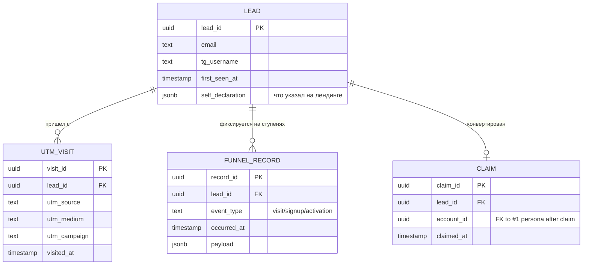

**Инвариант:** `LEAD` существует без `account_id` (до регистрации в Ory). `CLAIM` — одноразовое событие конверсии; после него PII-данные лида мигрируют в `#1 persona.account`, остальное остаётся в `#11` для аналитики воронки.

**Физ.объекты:** лид (О — Proto-Persona, человек до регистрации в Ory); UTM-визит (О — факт посещения с меткой); запись воронки `FUNNEL_RECORD` (О — зафиксированная ступень движения лида, с полем `event_type`, а не имя сущности «событие»); claim (О — факт конверсии лид→учётка).

### 3.12 #12 rewards — Награды

**Категория WP-257:** Память.Observed + Derived. **Writer:** rewards-engine (начисление по правилам из `#8 reference`), Методсовет (присвоение квалификации через Directus). **Owner:** Neon.

**BC:** Points, Achievements, Qualifications.

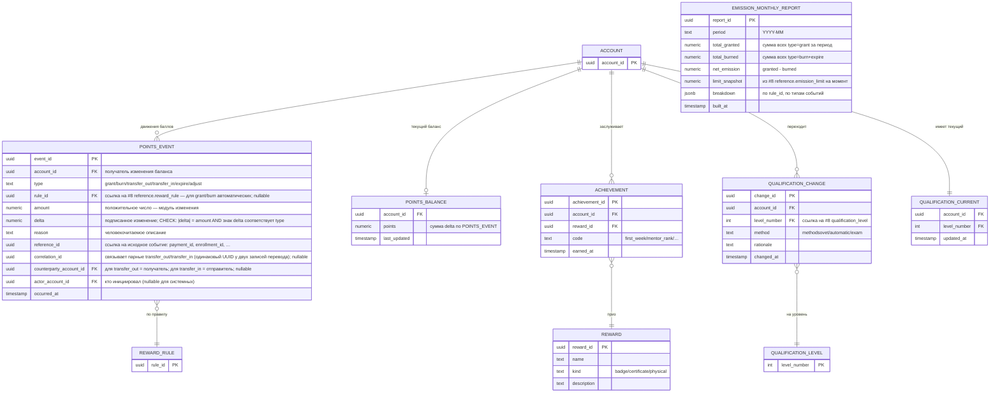

**Инвариант:**
- `POINTS_EVENT` — event-sourcing ledger: бизнес-поля (`type`, `amount`, `delta`, `rule_id`, `reference_id`, `occurred_at`) неизменяемы, никаких UPDATE/DELETE на них. Корректировки проводятся обратным `type=adjust` событием с противоположным знаком `delta`, с `reason` и `actor_account_id`. Допустимое исключение — анонимизация `account_id → NULL` по GDPR-delete (см. §10.9): это UPDATE PII-поля, не бизнес-факта; агрегаты `SUM(delta)` остаются корректными.
- `POINTS_BALANCE` — derived-проекция (С): `SUM(delta)` по `POINTS_EVENT` для `account_id`. Перестраивается триггером или scheduled job; проверяется периодически на консистентность.
- `EMISSION_MONTHLY_REPORT` — derived-проекция (С): агрегат всей эмиссии баллов за месяц + сравнение с лимитом из `#8 reference.emission_limit`. Строится регулярно (например, 1-го числа месяца). Отчёт сохраняется неизменяемым, чтобы Методсовет видел исторические уровни эмиссии. **Матчинг лимита:** `limit_snapshot` = значение `emission_limit.max_amount`, активного на момент **конца периода** `period` (последний день месяца 23:59:59). Если в пределах месяца менялся лимит — фиксируется последний активный; детализация смены — в `breakdown.limit_history`.
- `QUALIFICATION_CURRENT` — проекция (С) последнего `QUALIFICATION_CHANGE`. Перестраивается при каждом change.
- Отличие от RCS-ступени в `#5 indicators.rcs_current`: RCS двигает Портной (расчёт), квалификацию двигает Методсовет (решение).

**Физ.объекты:** событие баланса (О — одна запись ledger); достижение (О — присвоение награды учётке); смена квалификации (О — решение Методсовета или автомат-триггер); награда-приз (К — справочник призов). `POINTS_BALANCE`, `EMISSION_MONTHLY_REPORT`, `QUALIFICATION_CURRENT` — derived-проекции (С). Эмиссия баллов как управленческий факт = множество `POINTS_EVENT` с `type=grant` за период; лимит эмиссии живёт в `#8 reference.emission_limit` (О) как решение Методсовета.

**Списание и просрочка (expire):** механика «сгорания» баллов по времени — политика, определяемая в `#8 reference.reward_rule` (поле `expiry_policy`). Технически реализуется как планировщик, который генерирует `POINTS_EVENT.type=expire` при выполнении условий. Детальная спецификация политики — в WP-246 (см. §10.9).

### 3.13 External: LMS Aisystant (legacy монолит старой архитектуры; цель постепенной миграции)

**Категория WP-257:** вне пользовательской модели (внешняя система, короткий срок). **Writer:** LMS-команда (Дима). **Owner:** отдельная БД LMS (не Neon платформы). **Наше отношение сейчас:** read-only через bridges — зеркалим контекст (прохождения, квалификации, платежи) в `#6`, `#12`, `#3`, `#2` для Портного и истории пользователя.

**BC:** Legacy ШСМ Learning Management — монолит старой архитектуры, где все домены (курсы, пользователи, задания, прохождения, квалификации, платежи, события) смешаны в одной БД. Противоположность BC-aligned подходу новой архитектуры.

**Стратегия миграции (long-term):**
1. **Сейчас (пилот на IWE):** IWE реализует новую арх на 12 БД с нуля. LMS продолжает обслуживать ШСМ. Bridges зеркалят ШСМ-контекст для IWE-пользователей, которые также учатся в ШСМ.
2. **После стабилизации IWE:** запускается миграция ШСМ с LMS монолита на ту же архитектуру. Декомпозиция монолита на BC: курсы → `#6 learning`, платежи → `#3 payment`, квалификации → `#12 rewards`, события → `#2 journal` + `#10 community`.
3. **Best-of-old perserved:** архитектурные паттерны LMS, проверенные годами (наставничество, 11-ступенчатая квалификация Методсовета, COURSEPASSING, TASKANSWER+MENTOR_REVIEW, марафоны, ленты) **сохраняются как паттерны** в новой арх — см. §3.6.
4. **Декомиссия LMS:** после полной миграции ШСМ LMS выводится из эксплуатации. Bridges снимаются.

**Роль в коротком сроке:** source-of-truth для ШСМ-пользователей и исторических данных. `QUALIFICATION_LEVEL_EVENT` — единственный источник квалификаций Методсовета до миграции. Writes блокированы со стороны Neon — только чтение.

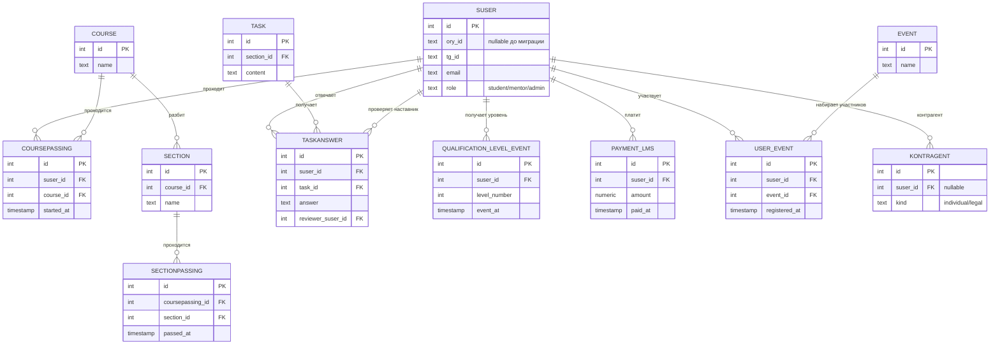

**Роль в миграции:** LMS остаётся source-of-truth до WP-254 (миграция 9 учебных объектов). `QUALIFICATION_LEVEL_EVENT` — единственный source-of-truth квалификаций до эстафеты в `#12 rewards.qualification_change`. Bridge — read-only, writes блокированы.

</details>

---

<details>
<summary><b>4. Связи между БД (межкластерные)</b></summary>

| Связь | От (БД.Объект) | К (БД.Объект) | Кратность | Тип | Комментарий |
|---|---|---|---|---|---|
| Пользовательская идентичность | #1.ACCOUNT.ory_id | Ory Kratos (внешняя) | 1:1 | FK | Persona layer, Д1 |
| Плательщик-Персона | #3.PAYER.account_id | #1.ACCOUNT | M:1 (nullable) | FK | Юрлицо может платить за другого |
| Активация контракта | #3.PAYMENT | #4.CONTRACT | 1:1 | FK | `activating_payment_id` |
| Контракт-Персона | #4.CONTRACT.account_id | #1.ACCOUNT | M:1 | FK | Исторический термин «грант» = `contract` |
| Тариф плана | #4.PLAN.tariff_id | #8.TARIFF | M:1 | FK | Справочник |
| Замер-Персона | #5.MEASUREMENT.account_id | #1.ACCOUNT | M:1 | FK | |
| Контракт → контекст замеров | #4.CONTRACT | #5.MEASUREMENT | 1:M | логическая | Замер имеет смысл в контексте активного контракта |
| Baseline ← события | #2.EVENT | #5.BASELINE | M:1 | агрегация | Портной читает события, пишет baseline |
| RCS-ступень ← справочник | #5.RCS_CURRENT.stage | #8.RCS_STAGE | M:1 | FK | |
| Зачисление-Персона | #6.ENROLLMENT.account_id | #1.ACCOUNT | M:1 | FK | |
| Программа зачисления | #6.ENROLLMENT.program_id | #8.PROGRAM | M:1 | FK | |
| Наставник в проверке | #6.MENTOR_REVIEW.mentor_account_id | #1.ACCOUNT (+ #10.MENTORSHIP) | M:1 | FK + Keto | |
| События обучения → Журнал | #6.* (events) | #2.EVENT | 1:1 | outbox projection | |
| Коллекция платформы | #7.COLLECTION.namespace | PACK-* (Git) | M:1 | проекция | |
| Параграф → Понятие | #7.PARAGRAPH | #7.CONCEPT | M:M | |  |
| Авторство Публикации | #9.DRAFT.account_id | #1.ACCOUNT | M:1 | FK | |
| Событие Публикации → Журнал | #9.PUBLICATION_EVENT | #2.EVENT | 1:1 | outbox | |
| Сообщество-Персона | #10.* | #1.ACCOUNT | M:M | через роли | Mentorship, Match, Ambassador — все через FK |
| Конверсия Лида | #11.CLAIM.account_id | #1.ACCOUNT | 1:1 | FK | После claim |
| Правило начисления | #12.POINTS_EVENT.rule_id | #8.REWARD_RULE | M:1 | FK | nullable для type=transfer/adjust |
| Уровень квалификации | #12.QUALIFICATION_CHANGE.level_number | #8.QUALIFICATION_LEVEL | M:1 | FK | |
| Баланс-Персона | #12.BALANCE.account_id | #1.ACCOUNT | 1:1 | FK | |

### Цветовая схема типов связей

- **FK** — прямая внешнеключевая связь в БД
- **Проекция** — rebuildable данные из другого источника
- **Outbox** — асинхронное копирование события в стрим
- **Агрегация** — writer читает источник, вычисляет, пишет результат
- **Логическая** — смысловая связь, не обязательно enforced на уровне БД (cross-DB)
- **Keto** — авторизация через политики Keto (Ory)

</details>

---

<details>
<summary><b>5. Потоки</b></summary>

### 5.1 Поток идентичности и доступа

От первого касания на лендинге до активной подписки.

```mermaid
sequenceDiagram
    actor User as Посетитель
    participant Landing as Лендинг
    participant Lead as #11 lead
    participant Ory as Ory Kratos
    participant Persona as #1 persona
    participant Pay as #3 payment
    participant Sub as #4 subscription
    participant Keto as Ory Keto

    User->>Landing: visit (UTM)
    Landing->>Lead: UTM_VISIT + LEAD
    User->>Landing: signup form
    Landing->>Lead: FUNNEL_RECORD (signup)
    Landing->>Ory: register identity
    Ory-->>Landing: ory_id
    Landing->>Lead: CLAIM (lead_id → account_id)
    Landing->>Persona: ACCOUNT (с ory_id)
    User->>Pay: оплачивает
    Pay->>Pay: PAYMENT + RECEIPT
    Pay->>Sub: активация CONTRACT (activating_payment_id; исторический термин — «GRANT»)
    Sub->>Keto: policy: user has access
    User->>Keto: request resource
    Keto-->>User: allow/deny
```

### 5.2 Поток событий → Показатели (Память.Observed → Память.Derived)

Как первичные действия превращаются в baseline и RCS-ступень.

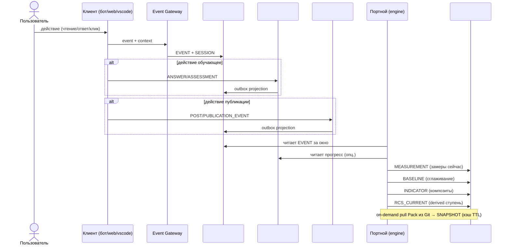

### 5.3 Поток содержания → Публикации

От черновика до многоканальной публикации.

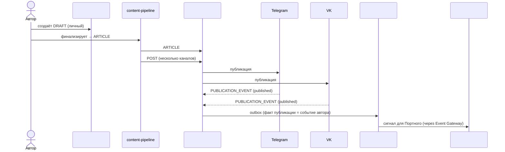

</details>

---

<details>
<summary><b>6. Писатели и читатели по БД</b></summary>


| БД | Пишут | Читают |
|---|---|---|
| #1 persona | пользователь (через VS Code/бот/веб/CLI), personal-indexer | Портной, Навигатор, Оркестратор, все клиент-интерфейсы, knowledge-search |
| #2 journal | event-gateway (от всех клиентов), outbox из #6/#9/#11 | Портной, Аналитика (Metabase view), Navigator |
| #3 payment | billing-webhook (ЮKassa, Stars), admin (Directus) | #4 subscription, отчёты, админка |
| #4 subscription | subscription-service | gateway-mcp (проверка прав), Keto (policy), бот, Персона flow |
| #5 indicators | Портной-engine | Навигатор, Оркестратор, Диагност, бот (progress bar), Оценщик |
| #6 learning | learning-service, Directus (наставники), scheduler | бот (ленты), Портной (сигналы), Metabase |
| #7 knowledge | knowledge-mcp indexer | gateway-mcp, все агенты (retrieval), content-pipeline |
| #8 reference | admin (Directus) | все сервисы, которые используют константы/тарифы/квалификации |
| #9 publication | content-pipeline | бот (анонсы), аналитика охвата, auth-proxy к каналам |
| #10 community | matching-engine, mentorship-service, referral-tracker, event-organizer | бот (анонсы встреч), Metabase, Навигатор |
| #11 lead | landing, acquisition-funnel | marketing analytics, Директор-УС (CRM), админка |
| #12 rewards | rewards-engine, Методсовет (Directus) | бот (баланс, ачивки), Персона (статус), публикации, Navigator |

</details>

---

<details>
<summary><b>7. Что осталось вне Neon (и почему)</b></summary>


| Не БД Neon | Причина | Где живёт |
|---|---|---|
| **Activity Hub (старый)** | был контейнер-смесь, не домен (Д11: событие ≠ хранилище) | распущен между #2/#3/#9/#11/#12 |
| **Health / Uptime** | SaaS закрывает задачу (Д2) | Better Uptime / Statuspage.io |
| **Metabase** | аналитический инструмент, не домен (Д2) | поверх #1-#12 через read-replica |
| **Ory identity** | внешняя система (Д1) | Ory Kratos, у нас только `ory_id` FK |
| **Ory Keto policies** | внешняя система | Ory Keto, у нас ссылки на relation_tuples |
| **FSM-state бота, message cache** | runtime-состояние, ephemeral | Redis / in-memory |
| **Pack пользователя (PACK-personal)** | Git пользователя, не Neon | GitHub, проекция → #1 |
| **Pack платформы (PACK-digital-platform, PACK-MIM, ZP, FPF, SOTA)** | Git команды, не Neon | GitHub, проекция → #7 |
| **On-demand pull Pack-состояния** | слой «Контекст» WP-257, runtime-сборка | не хранится; кэш → #5 `snapshot` |
| **LMS Aisystant** | монолит старой архитектуры (BC не разделены), на нём работает ШСМ; в переходный период IWE читает из него через bridges | отдельная БД LMS, read-only bridge в #6/#12/#3/#2; цель — постепенная миграция ШСМ на новую арх после стабилизации IWE |
| **Langfuse traces** | observability SaaS | Langfuse cloud |
| **WakaTime activity** | 3rd-party tracking | WakaTime cloud, pull → #2 journal (projection) |

</details>

---

<details>
<summary><b>8. Миграция 9 → 12 БД (эстафета в WP-253)</b></summary>


Планируется в **WP-253 (DP.ROADMAP.001)** — мастер-план фаз с gating-критериями. WP-228 Ф25 утверждает целевую карту, WP-253 Ф1 строит фазы.

### 8.1 Таблица переходов

| Текущая БД (9) | Целевая БД (12) | Действие | Зависимость РП |
|---|---|---|---|
| `platform` (#1 в v1) | Персона #1 + Подписка #4 + Справочник #8 | расщепить по writer/owner | WP-227, WP-253 |
| `knowledge` (#2 в v1) | Персона #1 (личные коллекции) + Знание-платформы #7 (платформенные) | расщепить по владельцу | WP-187 |
| `activity-hub` (#3 в v1) | Журнал #2 + Публикации #9 + Лид #11 + Награды #12 | распустить (Д11) | WP-253 |
| `payment-registry` (#4 в v1) | Платёж #3 + Награды #12 (баллы) | расщепить | WP-246 |
| `digital-twin` (#5 в v1) | Показатели #5 | переименовать (v1 → canonical) | WP-227 |
| `aist-bot` (#6 в v1) | Обучение #6 + Журнал #2 (events) + runtime (FSM → Redis) | расщепить по слоям | WP-254 |
| `metabase` (#7 в v1) | — | убрать (Д2, read-replica над другими) | WP-244 |
| `health` (#8 в v1) | — | убрать (Д2, внешний SaaS) | WP-244 |
| `content-pipeline` (#9 в v1) | Публикации #9 | переименовать | WP-155 |
| (новая) | Сообщество #10 | создать (extract из PMB-1 + WP-256) | WP-256 |
| (новая) | Лид #11 | создать (extract из v1 #3/#4) | WP-188 |
| (новая) | Награды #12 | создать (консолидация баллов + ачивок + квалификаций) | WP-253 |

### 8.2 Порядок миграции (ориентировочно)

1. **Подготовка** — DP.ROADMAP.001 (WP-253 Ф1): утвердить целевые имена, проверить занятость имён в Neon, подготовить DDL.
2. **Низкорискованные переименования** — `digital-twin → indicators`, `content-pipeline → publication` (WP-155 / WP-227).
3. **Расщепление `platform`** — вынести Подписку и Справочник в отдельные БД (WP-253 Ф2).
4. **Расщепление `knowledge`** — личные коллекции в #1, платформенные в #7 (WP-187).
5. **Роспуск `activity-hub`** — outbox projections в #2, #9, #11, #12.
6. **Миграция `aist-bot`** — учебные объекты → #6 learning (WP-254), runtime FSM → Redis.
7. **Создание новых БД** — #10 community (WP-256), #11 lead, #12 rewards.
8. **Снятие лишних** — вывести из production `metabase` DB, `health` DB.

### 8.3 Gating-критерии (уточняются в WP-253 Ф1)

Каждая фаза завершается, только если:
- DDL применён без потери данных (`COUNT` до/после совпадают)
- Все зависимые сервисы читают новую БД (env vars + code updated)
- Retention и PII-классификация соблюдены (WP-212 B7.3)
- Roll-back план задокументирован

</details>

---

<details>
<summary><b>9. Верификация (три чеклиста)</b></summary>


### 9.1 Чеклист SPF.SPEC.005 — выбор БД

Применение B.0 + B1-B4 + N1-N5 к каждой из 12 БД. Все клетки должны быть `✅` или `-` (не применимо).

| БД | B.0 категория | B1 единый writer-owner | B2 свой инвариант | B3 blast-radius | B4 свой словарь | N1 noun-area | N2 central entity | N3 no tech markers | N4 RU concept | N5 lowercase |
|---|---|---|---|---|---|---|---|---|---|---|
| #1 persona | Персона ✅ | пользователь ✅ | Git ↔ Neon consistency ✅ | ✅ независима | словарь Персоны ✅ | persona ✅ | ACCOUNT ✅ | ✅ | Персона ✅ | ✅ |
| #2 journal | Память.Observed ✅ | event-gateway ✅ | только-добавление ✅ | ✅ deletable | события ✅ | journal ✅ | EVENT ✅ | ✅ | Журнал ✅ | ✅ |
| #3 payment | Память.Observed ✅ | billing-webhook ✅ | идемпотентность платежей ✅ | ✅ (queue on outage) | биллинг ✅ | payment ✅ | PAYMENT ✅ | ✅ | Платёж ✅ | ✅ |
| #4 subscription | Память.Observed ✅ | subscription-service ✅ | период-FK к контракту ✅ | ✅ cached JWT | подписка ✅ | subscription ✅ | CONTRACT ✅ | ✅ | Подписка ✅ | ✅ |
| #5 indicators | Память.Derived ✅ | Портной ✅ | rebuildable из #2 ✅ | ✅ (Портной = single writer) | показатели ✅ | indicators ✅ | INDICATOR ✅ | ✅ | Показатели ✅ | ✅ |
| #6 learning | Память.Observed+Derived ⚠️ (множественные writers) | learning-service + mentors ⚠️ | наставник-ученик целостность ✅ | ✅ degraded OK | обучение ✅ | learning ✅ | ENROLLMENT ✅ | ✅ | Обучение ✅ | ✅ |
| #7 knowledge | Platform-knowledge ✅ | knowledge-mcp indexer ✅ | Git ↔ эмбеддинг consistency ✅ | ✅ stale OK | онтология ✅ | knowledge ✅ | CONCEPT ✅ | ✅ | Знание-платформы ⚠️ (составное имя) | ✅ |
| #8 reference | Catalog ✅ | admin (Directus) ✅ | temporal validity ✅ | ✅ read-heavy | справочник ✅ | reference ✅ | PROGRAM/TARIFF ✅ | ✅ | Справочник ✅ | ✅ |
| #9 publication | Память.Observed ✅ | content-pipeline ✅ | pipeline draft→article→post ✅ | ✅ retry safe | публикации ✅ | publication ✅ | POST ✅ | ✅ | Публикации ✅ | ✅ |
| #10 community | Relational ✅ | matching+mentorship+events ⚠️ (множественные) | симметричность связей ✅ | ✅ degraded OK | сообщество ✅ | community ✅ | MENTORSHIP/MATCH ✅ | ✅ | Сообщество ✅ | ✅ |
| #11 lead | Proto-Persona ✅ | landing+funnel ✅ | pre-Ory identity ✅ | ✅ standalone | лид ✅ | lead ✅ | LEAD ✅ | ✅ | Лид ✅ | ✅ |
| #12 rewards | Память.Observed+Derived ⚠️ | rewards-engine + Методсовет ⚠️ | баланс = Σ delta ✅ | ✅ (stale OK) | награды ✅ | rewards ✅ | POINTS_EVENT ✅ | ✅ | Награды ✅ | ✅ |

**Замечания:**
- **#6, #10, #12 — множественные writers.** По B1 строго требуется один семантический writer. Здесь принято сознательное решение: `#6 learning` имеет один BC «Learning Progress», внутри которого writer'ы делят разные аспекты (learner пишет ANSWER, mentor — REVIEW, scheduler — FEED_WEEK); аналогично `#10` и `#12`. Альтернатива — расщеплять каждый на 2-3 БД — признана преждевременной (Post-MVP decision).
- **#7 N4 составное имя** — «Знание-платформы» через дефис. N5 lowercase `knowledge` — ок. Альтернатива «Онтология» отвергнута (размывает: онтология включает и личную).

### 9.2 Замечания Андрея Д1-Д12 (Ф24 ревью 21 апр)

| # | Замечание | Где учтено в 12 БД |
|---|---|---|
| **Д1** | Очистить ядро Platform Core: Созидатель + права доступа (Ory — внешняя) | #1 persona = только декларация + preferences; Ory = `ory_id` FK, никаких собственных identity-таблиц |
| **Д2** | Убрать Health и Metabase из Neon | §7 — выведены на SaaS / read-replica |
| **Д3** | Субагент-исследование кода LMS Димы | §3.13 LMS ERD + bridge-контракт в §8 |
| **Д4** | Payment: плательщик, платёж, начисление, получатель, тарифы, методы оплаты + баллы | #3 payment (плательщик/платёж/метод/чек) + #12 rewards (баллы) + #8 reference (тарифы) + #4 subscription (получатель через грант). Расщеплено вместо одной «перегруженной» payment-registry |
| **Д5** | Knowledge универсальный: коллекция/документ/chunk отделены от concept/мем | #7 knowledge ERD: `COLLECTION → DOCUMENT → PARAGRAPH → EMBEDDING` отделено от `CONCEPT ↔ RELATION`. Личные коллекции — в #1 persona с той же структурой |
| **Д6** | Digital Twin: +пользователь, +квалификация, проверить JSON-модель | #5 indicators с явным `account_id` FK на все замеры; квалификация вынесена в #12 (по HD: квалификация — формальное присвоение, не замер) |
| **Д7+Д8+Д9** | Связи между ОБЪЕКТАМИ (не кластерами) + кратности + названия | §2 карта — все межкластерные стрелки object→object с кратностями 1:1/1:M/M:1/M:M и подписями; §4 таблица связей |
| **Д10** | Ревизия «объект ≠ атрибут» (множитель квалификации, уровень и т.п.) | §3 ERD — все ранее-ошибочные узлы свёрнуты в атрибуты (множитель — колонка `factor` в #8.MULTIPLIER, текущий уровень — derived в #12.QUALIFICATION_CURRENT) |
| **Д11** | Activity Hub: базовый объект «событие» | `activity-hub` БД распущен; central object «СОБЫТИЕ» живёт в #2 journal, узкие типы событий — в #9/#11/#12 outbox-проекциями |
| **Д12** | Созвон с Димой: Payment + LMS (какие объекты нужно отразить) | §3.13 LMS ERD отражает 10+ физ.объектов LMS; WP-228 Ф24 lms-audit — отдельный документ. Bridge-чекпоинт в §8 |

**Все 12 правок Андрея учтены.**

### 9.3 Полнота по категориям WP-257

| Категория WP-257 | Покрыто | Комментарий |
|---|---|---|
| **Персона** (writer=пользователь, owner=Git) | ✅ #1 persona | Центральная БД пользователя; Git-проекция индексируется в Neon |
| **Память.Observed** (writer=платформа, event-based) | ✅ #2 #3 #4 #9 | Журнал как универсальный event-stream; домен-специфичные события в #3/#4/#9 |
| **Память.Derived** (writer=engine, расчётный) | ✅ #5 | Портной владеет всеми расчётами (RCS, baseline, potential, индикаторы) |
| **Память.Observed+Derived** (смешанные writers) | ⚠️ #6 #12 | #6 learning и #12 rewards имеют наблюдаемые (ответ, платёж) и расчётные (оценка, квалификация) таблицы вместе — сознательное решение, BC един |
| **Platform-knowledge** (проекция онтологии) | ✅ #7 | knowledge-mcp индексирует платформенные Pack; личные — в #1 |
| **Catalog/Reference** (writer=admin) | ✅ #8 | Тарифы, ступени, уровни квалификации, правила |
| **Relational** (связи Persona↔Persona) | ✅ #10 | Полный цикл: matching → поддержка → события → развитие |
| **Proto-Persona** (до Ory) | ✅ #11 | Лид → claim → Персона |
| **Service/Ops** | ❌ 0 БД | Вынесено на SaaS (Д2) |
| **Контекст** (runtime, не хранится) | ❌ не БД | Runtime промпт-сборка, кэш on-demand → #5 SNAPSHOT |

**Покрытие полное за вычетом Service/Ops (сознательный отказ Д2) и Контекст (не storage-категория).**

### 9.4 Применённые различения (проверка)

| Различение (HD / distinctions.md) | Где применено в архитектуре |
|---|---|
| Персона ≠ Память ≠ Контекст (DP.D.052, HD #27) | §1 сводная таблица — категория WP-257 для каждой БД |
| Событие ≠ Хранилище-контейнер (Р-W17-1, Д11) | Activity Hub распущен (§8), `#2 journal.EVENT` — единственное место всех событий |
| Объект ≠ Атрибут (Д10) | Все ERD в §3 — множители/коды/lookup как атрибуты, не узлы |
| Система ≠ Роль (D.141 PD) | `#1.ACCOUNT` = система; mentorship/ambassador в `#10` = роли через связи |
| Характеристика ≠ Показатель ≠ Значение ≠ Потенциал (D.140) | `#5 indicators` — `MEASUREMENT` (значение-сейчас) + `BASELINE` (устойчивое значение) + `POTENTIAL` + `INDICATOR` (композит); `CHARACTERISTIC` определяется в Pack, не в БД |
| RCS-ступень ≠ Уровень квалификации | `#5.RCS_CURRENT` (derived Портным, 5 ступеней) vs `#12.QUALIFICATION_CURRENT` (formal Методсовет, 11 уровней) |
| Объект ≠ Отношение (WP-228 19 апр, Andrey) | ERD показывают только объекты с именами собственными; служебные M:N без атрибутов — на физ.схеме |
| PII ≠ payment_credentials | `#3.SAVED_PAYMENT_TOOL.masked_id` + `provider_token_ref` явно помечены `payment_credentials` — строже PII |
| Рабочий документ ≠ Публикация | `#1.NOTES` + `#1.CAPTURES` (черновое) vs `#9.PUBLICATION_EVENT` (факт публикации) |
| Бесплатный Gateway ≠ Полный Gateway (DP.SC.112) | #1 персональные коллекции доступны подписчикам; #7 платформенные — всем аутентифицированным |
| ER ≠ Физ.схема | §3 — концептуальная ER; физ.схема с индексами/партициями — в WP-253 Ф2 |

**Все ключевые различения применены.**

### 9.5 Легенда маркеров физ.объектов / проекций / ролей / классификаторов

Каждая сущность в картах §3 помечается одним из четырёх маркеров:

| Маркер | Что значит | Примеры |
|--------|-----------|---------|
| **(О)** Объект | Физ.объект домена или зафиксированный факт: у экземпляра можно показать пальцем, дать имя. Writer — система-владелец, запись появляется в ответ на событие физ.мира. | платёж, зачисление в программу, встреча, пост, руководство, правило распределения дохода, событие баллов |
| **(С)** Снимок / проекция | Derived-состояние: вычисляется из событий/объектов. Не самостоятельный факт, а агрегат или кэш. Writer — процессор/scheduler. | `baseline`, `potential`, `rcs_current`, `course_progress`, `points_balance`, `emission_monthly_report`, `qualification_current`, `snapshot` |
| **(Р)** Роль | Функциональное место Персоны в другой системе (HD «Система ≠ Роль»). На ER-диаграмме роль = запись о присвоении, не отдельная сущность. | наставник, амбассадор, автор руководства, учредитель гранта |
| **(К)** Классификатор / справочник | Эталон, редко меняемый словарь. Writer — админ через Directus. Читается многими системами. | `payment_kind`, `rcs_stage`, `qualification_level`, `multiplier`, `constant`, `reward` (тип приза) |

**Правило:** в схеме `erDiagram` помечается сущность в сводной таблице §1. В §3 — в блоке «Физ.объекты:» каждой БД.

**Тест при добавлении новой сущности:** «Можно ли дать экземпляру имя собственное и показать пальцем?» — Да → (О). Нет, это агрегат/кэш? → (С). Нет, это функциональное место Персоны? → (Р). Нет, это справочный эталон? → (К).

</details>

---

<details>
<summary><b>10. Открытые вопросы</b></summary>


### 10.1. Расщепление #6/#10/#12 (множественные writers)

B1 проход `⚠️` у трёх БД. Вопрос: нужен ли follow-up РП по строгой ревизии после MVP? Кандидат: **WP-258-post-mvp-db-split** (Q3 2026) — проанализировать, оправдано ли совмещение писателей, или BC надо расщеплять.

### 10.2. `#7 knowledge` N4 составное имя

«Знание-платформы» через дефис — не идеально по N4 (single-word в русском). Альтернатива «Онтология» отвергнута (включает личную). Текущее решение — записать в name_rationale: «двусоставное имя допустимо, когда русский single-word создаёт онтологический конфликт».

### 10.3. Пакетное переименование БД в prod

Не раньше DONE зависимых WP (WP-155, WP-246, WP-187, WP-254). Требует: DDL migration + env vars update + MCP tool names + bot handlers update. Эстафета — WP-253.

### 10.4. Сервисы Persona / Memory / Projection

Pack-сущности определены (DP.ARCH.005 Persona Entity, DP.ARCH.006 Memory Record, DP.ARCH.007 Projection — WP-257 Ф5, 22 апр 2026, заменили монолитный DP.ARCH.003). Выделение соответствующих runtime-сервисов (persona-mcp / memory-mcp / projection-service) — открытый вопрос реализации, решается в WP-253 мастер-плане по БД + будущих ArchGate.

### 10.5. Retention / GDPR политики

Временные окна для таблиц-журналов только-добавления (`#2.EVENT`, `#9.PUBLICATION_EVENT`, `#11.FUNNEL_RECORD`, `#12.POINTS_EVENT`) не зафиксированы. WP-240 Retention policy — уточнить в Q2.

### 10.6. Plugin API L2 (WP-258)

Как внешние разработчики расширяют Персону и Показатели, не трогая L2 ядро? Design в Q3 (WP-258 из WP-250 Ф-F.4).

### 10.7. Контракт bridges с LMS

LMS Aisystant — монолит **старой архитектуры**, на нём работает ШСМ. Новая архитектура (12 БД, BC-aligned) реализуется **сначала в IWE** как пилот; ШСМ **постепенно мигрирует** на неё после стабилизации IWE. В переходный период — read-only bridges в Neon: прохождения ШСМ → `#6` / `#2`, квалификации Методсовета → `#12`, платежи ШСМ → `#3`. Фиксация контрактов bridges — `DP.ARCH.008-lms-bridge-contracts.md` (WP-254 Ф0; ID сдвинут — DP.ARCH.005/006/007 заняты под Persona/Memory/Projection в WP-257 Ф5).

**План перехода (4 шага):**
1. **Сейчас — пилот на IWE.** Новая архитектура строится сразу на 12 БД Neon. IWE работает как пилотный продукт на новой арх.
2. **После стабилизации IWE — постепенная миграция ШСМ.** Функции ШСМ (курсы, прохождения, ДЗ, наставничество, квалификации) переносятся из LMS в соответствующие BC-БД: `#6 learning`, `#2 journal`, `#12 rewards`, `#3 payment` — с сохранением пользовательского опыта.
3. **Best-of-old preserved.** Проверенные паттерны LMS (COURSEPASSING, SECTIONPASSING, TASKANSWER, формальная квалификация) переносятся как базовые контракты новой арх — см. §3.6 и §3.13.
4. **Декомиссия LMS.** После полной миграции ШСМ и истечения архивного окна — LMS выводится из эксплуатации.

### 10.7.1. Mutual read-only LMS↔Neon transition (WP-268, 26 апр 2026)

> **Решение Tseren от 26 апр 2026.** Расширяет §10.7 (контракт bridges с LMS): помимо чтения LMS из Neon добавляется обратная видимость — LMS получает read-only-доступ к выходам Neon (например, к платежам, принятым от @aist_me_bot через `#3 payment`). Ни одна сторона не пишет в чужую БД.

**Контракт двух систем (mutual read-only + write по доменам):**

| Сторона | Что пишет (writes) | Что читает у соседа (reads) |
|---------|---------------------|------------------------------|
| **Neon (новая)** | свои домены 12 БД: оплаты от @aist_me_bot (`#3`), события Bridge-2 (`#2`+`#6`+`#12`), ЦД calculated (`#5`), персональные коллекции (`#7`), bot события и активности | LMS read-only через Bridge-1 (subscriptions) + Bridge-2 (events): `COURSEPASSING`, `QUALIFICATION_LEVEL_EVENT`, `PAYMENT_LMS`, `USER_EVENT` для зеркалирования в `#6`/`#12`/`#3`/`#2` |
| **LMS Aisystant (legacy)** | свои домены: курсы, прохождения, квалификации Методсовета, исторические платежи ШСМ | Neon read-only views: принятые платежи `#3.PAYMENT` от бота (зеркалятся в `PAYMENT_LMS` для CRM-учёта на стороне ШСМ); статусы подписок `#4.CONTRACT` (видимые в LMS как «активная БР для пользователя X»); квалификации `#12.QUALIFICATION_CHANGE` (зеркало в `QUALIFICATION_LEVEL_EVENT` для непрерывности учёта Методсовета) |

**Ключевой инвариант (БЛОКИРУЮЩИЙ):**

- LMS **НЕ пишет в Neon.** Neon **НЕ пишет в LMS.**
- Единственная связь — read-only views (выделенные read-only роли БД с ограничением WHERE и фильтром PII) + Bridge polling.

**Что меняется относительно v2.3:**

1. §10.7 (контракт bridges) расширен с однонаправленного read «LMS → Neon» на **двунаправленный read** (LMS↔Neon), сохранив ban на cross-write.
2. Снимается **source-of-truth dilemma transition period:** каждая БД остаётся owner своих доменов (никаких перемещений source-of-truth до полной декомиссии LMS). Переход — не cut-over, а «coexistence с двумя владельцами доменов и mutual read-only».
3. Стратегия декомиссии LMS (§10.7 шаг 4) **остаётся в силе как long-term цель**, но не становится pre-condition для запуска новой архитектуры. LMS может сосуществовать с Neon неограниченно долго.

**Технические следствия:**

- **Read-only роли БД:** на стороне LMS — `aisystant_neon_reader` с SELECT на `aisystant.*` (исключая raw PII payloads); на стороне Neon — `lms_aisystant_reader` с SELECT на views `vw_payment_for_lms`, `vw_contract_for_lms`, `vw_qualification_for_lms` (только агрегированные/анонимизированные данные, поля PII фильтруются на уровне view; исторический термин view — `vw_grant_for_lms`, переименован в v2.4.1 28 апр).
- **Account ID mapping:** требуется **lookup-таблица** соответствий `aisystant.suser.id ↔ #1.persona.account_id` (через `ory_id` в LMS `suser` и `traits` в Neon `ory_identity`). Эта таблица — единственный «cross-system bridge» концепт; должна быть либо в `#11 lead.proto_persona` (если Lead и Persona ещё не объединены), либо в `#1 persona.account_external_ref` (как FK к LMS).
- **Bridge-2 events polling** (WP-268 T4) — новый сервис, который реализует чтение `aisystant.user_lessons`/`qualifications` и POST в `event-gateway` /events с idempotency-key `lms-evt-{lms_id}`. Запускается на Railway, cursor в `#6 learning.bridge_cursors`.
- **Reverse-bridge LMS-side polling** (на будущее, в этом WP не реализуется): LMS-сервис может периодически SELECT'ить из Neon read-only views и зеркалить нужное в свои таблицы (`PAYMENT_LMS`, `QUALIFICATION_LEVEL_EVENT`). Дизайн контракта — отдельный артефакт `DP.ARCH.008-lms-bridge-contracts.md` (упомянут в §10.7).

**Что не меняется (для предотвращения путаницы):**

- §3.13 «External: LMS Aisystant» остаётся в категории **External BC** — внешняя система, не часть Neon-архитектуры.
- Long-term цель **декомиссии LMS** сохраняется как gradient (~годы), но без жёстких сроков.
- BC-aligned принцип Neon (database-per-BoundedContext) сохраняется без изменений.

**Решение действительно для:** WP-268 booster (расширение БД до 9 + Bridge-2 backfill); WP-254 (миграция учебных объектов #6); WP-257 Ф5 (Persona/Memory сервисы); WP-250 Ф-F.1 ADR (граница L2/L3, цитирует mutual read-only как пример coexistence с легаси).

**Решение отменяет:** неявное предположение MVP-greenfield-only (ArchGate v3 25 апр), что Neon должна полностью заменить LMS до начала использования. Теперь они coexist'уют на bridges.

### 10.8. Revenue sharing — координация с WP-257 (Persona / Memory / Projection)

Сущности `REVENUE_SHARE_CONTRACT`, `PAYMENT_SPLIT`, `PAYOUT` в `#3 payment` + `REVENUE_SHARE_RULE` в `#8 reference` определяют финансовые обязательства платформы перед получателями (авторы руководств, наставники, маркетинг, бюджет МИМ, прочие). Открытые вопросы:
1. **Получатель = Персона или отдельная сущность «получатель платежа»?** Текущее решение — FK `payee_account_id → #1 persona.account` для физ.лиц и самозанятых, плюс `payee_legal_name` как снимок для юрлиц и ИП без учётки. Ревизия — в WP-257 Ф5 (сервисы Persona / Memory), возможна отдельная сущность `payee_party` в `#1`, если реестр получателей станет многопрофильным.
2. **Сплит на уровне платежа или на уровне периода?** В MVP — per-payment split (каждый входящий платёж расщепляется на N `PAYMENT_SPLIT`). Для месячных аккумуляций и «автоматических» выплат раз в месяц — отдельный механизм агрегации в `PAYOUT`, не на уровне отдельного сплита. Дизайн — в child-WP после WP-253 Ф1.
3. **Кто согласовывает изменение `REVENUE_SHARE_RULE`?** Методсовет или финслужба МИМ? Процедура внесения правки — отдельное решение (не этот документ), фиксируется в SoP ведения справочника.

### 10.9. Expire баллов и retention `POINTS_EVENT`

- **Политика сгорания:** каждое `REWARD_RULE` получает поле `expiry_policy` (например «12 месяцев после начисления», «в конце календарного года», «не сгорает»). Планировщик периодически генерирует `POINTS_EVENT.type=expire` по этим правилам. Конкретные политики — в WP-246 Стадия 2 (Stars-экономика) или в отдельном WP, если политики потребуются раньше.
- **Retention `POINTS_EVENT`:** ledger — только-добавление, удалять нельзя (аудит эмиссии). Для старых учётных записей после GDPR-delete — анонимизация `account_id` → NULL, агрегированные значения сохраняются в `EMISSION_MONTHLY_REPORT`. Окончательный дизайн — в WP-240 Retention policy (Q2).

### 10.10. Admin-tools placement: state-files рядом с исполнителем (WP-268 Phase 3, 29 апр 2026)

> **Решение Tseren от 29 апр 2026 (ArchGate WP-268 Блокер 3).** Admin-tools (CMS, observability dashboards, dev consoles) НЕ являются entity-БД из 12 BC и НЕ размещаются в Neon-стэке. Их state-файлы (framework metadata: collections, fields, sessions, activity, revisions) живут в **локальном Postgres рядом с исполнителем** — по принципу различения «State file ≠ Лог ≠ Инцидент» (DP.D.049, distinctions.md).

**Применённый случай 1 — Directus (29 таблиц, 290 rows admin metadata, 29 апр 2026):**

| Параметр | До (legacy) | После (29 апр 2026) |
|----------|-------------|---------------------|
| Placement | `platform.directus.*` (Neon) | `directus.directus.*` (Railway Postgres, peaceful-vision/Postgres cluster) |
| User | `neondb_owner` (admin Neon) | `directus_admin` (только эта database) |
| Connection | `DB_CONNECTION_STRING` к Neon platform | `DB_CONNECTION_STRING` к Railway internal `postgres.railway.internal:5432/directus` |
| Backup | через snapshot Neon platform | ежедневный `pg_dump` в `~/IWE/_local-archive/directus/`, retention 7d (см. `synchronizer/scripts/backup-directus.sh`) |
| Secrets registry | n/a | `B2.1 Secrets Inventory` строка `DB_CONNECTION_STRING (Directus)` |

**Применённый случай 2 — Bot fsm_states (1 таблица, 36 rows aiogram FSM persistence, 29 апр 2026):**

| Параметр | До (legacy) | После (29 апр 2026) |
|----------|-------------|---------------------|
| Placement | `platform.public.fsm_states` (Neon) | `fsm.public.fsm_states` (Railway Postgres, peaceful-vision/Postgres cluster) |
| User | `neondb_owner` (legacy DATABASE_URL) | `fsm_admin` (только эта database) |
| Connection | `_pool` через `DATABASE_URL` | отдельный `_fsm_pool` через `FSM_URL` env (`get_fsm_pool()` в `db/connection.py`) |
| Writers | `core/storage.py` PostgresStorage (set/get state/data на каждое сообщение); `core/scheduler.py` cleanup DELETE >30d; `db/queries/profile.py` GDPR delete | те же writers, но через `get_fsm_pool()` |
| Backup | через snapshot Neon platform | ежедневный `pg_dump` в `~/IWE/_local-archive/fsm/`, retention 7d (см. `synchronizer/scripts/backup-fsm.sh`) |
| Secrets registry | n/a | `B2.1 Secrets Inventory` строка `FSM_URL` (приоритет средний — state file восстанавливается при следующем сообщении user'а) |

**Применённый случай 3 — Lift-and-shift legacy `platform` → `bot_data` (57 таблиц, 30MB → 57MB, 29 апр 2026 — Phase 4):**

| Параметр | До (legacy) | После (29 апр 2026, Phase 4) |
|----------|-------------|---------------------------------|
| Placement | `platform.{public,development}` (Neon, 47+8 таблиц) | `bot_data.{public,development}` (Railway PG, тот же кластер что fsm/directus) |
| User | `aist_bot_writer` (Neon) | `bot_admin` (только эта database) |
| Connection | `DATABASE_URL` + `DT_DATABASE_URL` + `SUBSCRIPTION_DB_URL` + `NEON_FINANCE_URL` к Neon platform | те же 4 env vars к Railway internal `postgres.railway.internal:5432/bot_data` |
| Bot code | `_pool` через legacy `_pool` | без изменений (один env switch на 4 vars) |
| Backup | Neon snapshots | TODO (паттерн `backup-bot-data.sh` + scheduler) |

**Применимость паттерна (другие кандидаты):** Metabase metadata (БД #7 в DP.ARCH.004 §3.7 — отдельный решённый вопрос), Grafana/Langfuse при self-hosting.

### 10.11. Tech debt: bot_data — монолит-копия legacy platform (Phase 4 quick path)

**Контекст 29 апр 2026:** при подготовке к DROP `platform` обнаружено что 30+ таблиц всё ещё активно пишутся ботом (billing, identity, bot state, analytics). Полная миграция в правильные 12-BC БД оценена ~76-114h aggregate (~4 недели). Tseren принял решение: «таблицы тестовые, не критично, ждать недели нельзя» — выбран **lift-and-shift в одну новую БД `bot_data`** (Railway PG) с DROP platform после env switch.

**Tech debt — что не сделано (по плану Plan agent 29 апр, source-of-truth для миграции):**

| Группа | Источник (bot_data таблицы) | Target (12-BC БД) | Bot code файлы | Зависимости | Эстимат | Sequence |
|---|---|---|---|---|---|---|
| **G1 Identity core** | users, ory_tokens, oauth_pending_states, user_integrations | `persona` (#1) | `db/queries/{users,ory_tokens,oauth_states,profile}.py`, `oauth_server.py` | WP-269 read-path persona готов | 12-18h | **P0 блокер для G2/G3/G6/G7/G8** |
| **G2 User state/sessions** | user_state, user_sessions, feed_sessions, feed_weeks | `journal` (#2) или Railway-local FSM-pattern | `db/queries/{sessions,feed}.py`, `core/scheduler.py` | G1 (FK на users) | 8-12h | P1 после G1 |
| **G3 Billing writers** | subscription_grants, subscriptions, finance_payments, workshop_payments, service_usage | `subscription` (#4) + `payment` (#3) через payment-registry | `db/queries/subscription.py`, `payment-registry/scripts/*` | G1 + WP-270 multi-domain-projection | 14-20h | **P0 high write volume** |
| **G4 Analytics events** | development.user_events (~70k ins) | `journal` (#2) event-стрим | `db/queries/{events,analytics,conversion}.py` | G1 (persona_id resolution) | 6-10h | P1 после G1 |
| **G5 Notifications/traces/errors** | notification_log, request_traces, error_logs | `learning.domain_event` | `db/queries/{notifications,errors}.py`, `core/error_handler.py` | WP-253 read-path сделан; **независим от G1** | 6-8h | P2 |
| **G6 Indicators / DT** | digital_twins (legacy) | `indicators.calculated_profile` (#5) | `db/queries/{dt_sync,dt_tokens}.py` | WP-269 dual-write уже; **независим от G1** | 4-6h | **P1 — самый низкорискованный first step** |
| **G7 Publications** | published_posts, scheduled_publications, channel_monitors, channels | `publication` (#9) | `db/queries/{channels,showcase,discourse}.py` | G1 | 8-12h | P2 |
| **G8 Learning artefacts** | marathon_content, reminders, training_*, pending_fixes, feedback_reports, community_members | `learning` (#6) + `community` (#10) | `db/queries/{marathon,nudges,autofix,feedback,activity,training,assessment}.py` | G1 | 14-20h | P2 |
| **G9 Cache** | content_cache | Redis / drop (TTL 7d, regenerate) | `db/queries/{cache,marathon}.py` | независимо | 2-4h | P3 |

**Sequence (что блокирует что):**
- G1 (Identity → persona) — критический блокер: `users.id` / `ory_identity` = FK target для G2/G3/G6/G7/G8.
- G3 (Billing) зависит от G1 + payment-registry routing.
- G4 (Analytics) зависит от G1 (persona_id lookup).
- **G5, G6, G9 — независимые** (могут идти параллельно G1 или раньше).

**Параллельные потоки (3 сессии могут идти одновременно):**
- Поток A: G1 → G2 → G8 (sequential identity-chain)
- Поток B: G5 + G6 (independent, read-path уже готов)
- Поток C: G3 (после G1, через payment-registry)

**Total estimate:** 76-114h aggregate. При 3 параллельных потоках = 3.5-5 календарных недель. Ранний first-step без зависимостей = **G6 (4-6h)**.

**Frozen без миграции (archive, не migrate):** `finance_payments_sync_state`, `import_staging_*`, старые `feedback_reports` snapshot, deprecated `discourse`/`wakatime` (если только админ), `error_logs` дубликат к learning. Решение: `platform_archive` schema или dump в S3, REVOKE INSERT/UPDATE.

**Последствия отложенной нормализации:**
- Database-per-BC принцип НЕ соблюдается для `bot_data` (миксует identity + billing + analytics + state в одной БД).
- При накоплении нагрузки могут проявиться coupling issues (write contention, cross-domain queries).
- Refactor возможен в любой момент per-group (G1-G9) без блокировки других.

**Реальный first step (2-3h на следующей сессии):**
1. Inventory diff + FK constraint graph для bot_data (~30 мин) → точные зависимости.
2. G10 archive decisions (~45 мин) — ~15 малоактивных таблиц classify migrate/archive/drop → −10..15 из scope.
3. G6 spike (60-90 мин) — DT writer cutover (минимально-инвазивно, indicators.calculated_profile уже готов).


**Не применять для:** entity-БД из 12 BC (persona, journal, payment, …) — для них Neon-стэк остаётся source-of-truth по принципу database-per-BoundedContext.

**Принципы покрытия:** OwnerIntegrity (Directus owns свои metadata, нет внешних writers), DDD Strategic SOTA.001 (BC изолирован — separate DB engine, separate ownership), DP.D.049 (State file ≠ Лог: state-файлы рядом с исполнителем).

**Артефакты ArchGate:** профиль ЭМОГССБ для 5 вариантов (а: новая Neon БД directus / б: Railway Postgres / в: reference.directus / г: health.directus / д: status quo) — вариант (б) принят как наименьшее число ⚠️ при отсутствии ❌ в критических Безопасность+Эволюционируемость; conjunctive screening отбраковал (в),(г),(д).

</details>

---

<details>
<summary><b>11. Связанные артефакты</b></summary>


- **Карта данных (операционный трекер):** `DS-my-strategy/inbox/WP-228-neon-data-map.md`
- **Мастер-план миграции:** `PACK-digital-platform/.../DP.ROADMAP.001` (в WP-253 Ф1)
- **Аудит LMS:** `DS-my-strategy/inbox/WP-228-F24-lms-audit.md`
- **Правила границ:** `SPF/spec/SPF.SPEC.005-boundary-rules.md`
- **Метод ER-моделирования:** `PACK-digital-platform/.../DP.METHOD.040-er-modeling.md`
- **Канон Персона/Память/Контекст:** `memory/project_persona_memory_context.md` (DP.D.052)
- **Классификация данных (B7.3):** WP-212 B7.3.1 L2 Data Classification Map — драфт готов 28 апр (`DS-ecosystem-development/.../Data-Governance/B7.3.1-l2-data-classification-map.md`), pending review Паши, после утверждения промоция в Pack-DP как самостоятельный `DP.ARCH.NNN-data-classification.md`.

### 11.1. Потомки (WP-234..241, маршрутизация Ф29 от 24 апр)

Справочная таблица — откуда взялись 8 РП, порождённых § 9 исходной версии (v2.0) DP.ARCH.004, и куда они маршрутизированы как child-WP. Ведутся отдельными строками в `DS-my-strategy/docs/WP-REGISTRY.md` с явным `parent:`. Данная таблица — single-reference для аудита при реопене WP-228 или при обсуждении Security/Observability/Roadmap.

| WP | Замечание / артефакт | Parent | Бюджет | Приоритет |
|----|----------------------|--------|--------|-----------|
| WP-234 | Fernet OAuth-токены (ORY/DT/GITHUB/GCAL/USER_INTEGRATIONS) TEXT→BYTEA | WP-212 B7.3 | 16h | критический |
| WP-235 | Cloudflare KV cache для `checkSubscription()` в gateway-mcp | WP-187 | 8h | средний (post-MVP) |
| WP-236 | OTel `trace_id` CHAR(32) в RAW→USER→LEARNING (activity-hub) | WP-244 | 12h | высокий |
| WP-237 | Postgres trigger `tr_log_payment_changes` + `FINANCE_PAYMENTS_AUDIT_LOG` (7 лет) | WP-246 Стадия 2 (xref WP-212) | 10h | высокий |
| WP-238 | RLS для Metabase → payment-registry (`metabase_reader` + views без PII) | WP-212 Ф9 | 6h | средний |
| WP-239 | SSRF валидация `BACKEND_REGISTRY` (https, RFC1918 reject, port deny) | WP-212 B7.3 | 6h | средний |
| WP-240 | Retention policy всех 12 БД + GDPR-анонимизация `POINTS_EVENT.account_id` | WP-253 P7 Operational Hardening | 16h | средний |
| WP-241 | Backup/DR: PITR per-database + pg_dump → S3, payment-registry PITR 30d | WP-253 P5 Payment-registry split | 14h | средний |

**Правило:** решение Ф29 — все 8 как **Link (child-WP)**, никаких Fold. Причина: каждая задача имеет самостоятельный артефакт, свой lifecycle и отдельного исполнителя. Fold-варианты (WP-235→WP-250, WP-236→WP-253 Ф9.1, WP-238→WP-232, WP-239→WP-258) отклонены субагент-ревью 24 апр — риск потери задачи в почти-закрытых или нерелевантных по скоупу родителях.

**При реопене WP-228 (Ф30+):** если новая структурная правка DP.ARCH.004 порождает новую безопасную/observability/infra-задачу — создавать отдельный WP-NN и маршрутизировать через этот реестр.

</details>

---

<details>
<summary><b>12. История версий</b></summary>


| Версия | Дата | Описание |
|---|---|---|
| v1 | 14 апр 2026 | Первая версия: 9 БД, монолитный «ЦД» в `digital-twin`, `activity-hub` как контейнер-смесь |
| v1.1 | 19 апр 2026 | +`content-pipeline` БД (9-я база); §7.0.2 реестр физ.объектов |
| v1.2 | 21 апр 2026 | Ф24 правки Андрея (Д1-Д12): очистка Platform Core, вынос Metabase/Health, роспуск Activity Hub подготовлен |
| **v2** | **22 апр 2026** | **Целевая карта 12 БД (Ф25): расщепление ЦД → Персона/Память/Контекст (WP-257); новые БД Сообщество/Лид/Награды; вынос SaaS; верификация по 3 чеклистам** |
| **v2.1** | **22 апр 2026** | **Ф26 уточнение стратегии реализации: новая арх реализуется сначала в IWE (пилот), ШСМ постепенно мигрирует на неё после стабилизации IWE; LMS Aisystant = legacy монолит старой арх, цель постепенной миграции; лучшие паттерны LMS переносятся в новую арх (§3.6, §3.13, §7, §10.7)** |
| v2.2 | 23 апр 2026 | Ф27 ревизия физ.объектов, revenue-sharing, points-ledger: маркеры О/С/Р/К, POINTS_EVENT ledger, EMISSION_MONTHLY_REPORT, REVENUE_SHARE_CONTRACT/PAYMENT_SPLIT/PAYOUT, SAVED_PAYMENT_TOOL, FK-фикс ENROLLMENT→PROGRAM (23 правки) |
| v2.3 | 24 апр 2026 | Ф29 восстановлена секция § 11.1 «Потомки (WP-234..241, маршрутизация)» — справочная таблица замечание→parent-РП для аудита при реопене WP-228; решение Link (child-WP) без Fold подтверждено субагент-ревью |
| **v2.4** | **26 апр 2026** | **§10.7.1 Mutual read-only LMS↔Neon transition (WP-268): двунаправленный read-only без cross-write; Neon → LMS read-only views (платежи, гранты, квалификации) + LMS → Neon Bridge polling; снимается source-of-truth dilemma transition period; LMS coexist-уют с Neon неограниченно долго; ban на cross-write остаётся БЛОКИРУЮЩИМ инвариантом** |
| **v2.4.1** | **28 апр 2026** | **§3.4 + §1 + §6 + §7 терминологический apply: `GRANT` → `contract`, `GRANT_HISTORY` → `contract_event` (исторический термин «грант» сохранён как синоним для читаемости). Drift между Pack ER и реальным DDL `mvp/009-subscription-schema.sql` устранён. Триггер: WP-246 verify-субагент 28 апр обнаружил расхождение Pack ↔ код, блокирует Ф1.5 порт payment-receiver. Patch не меняет границы BC, инварианты, кратности — только имена canonical-таблиц.** |

</details>
